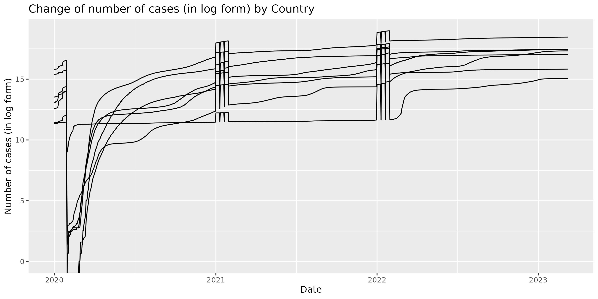
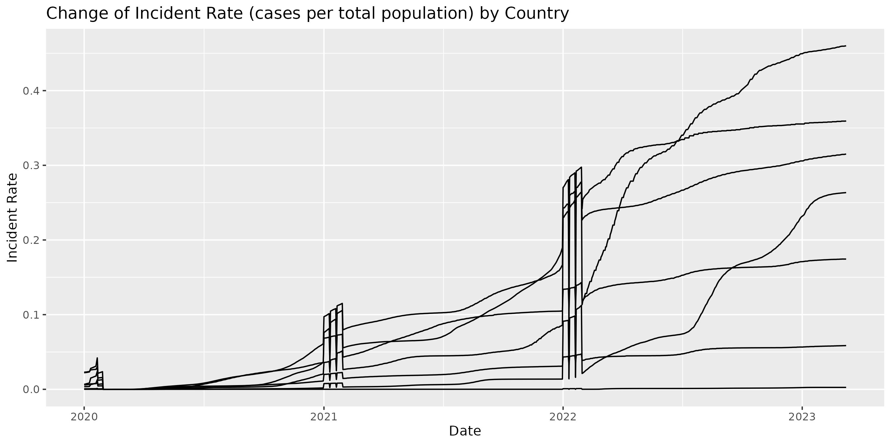
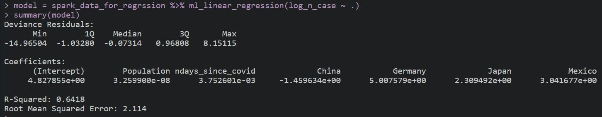

## Introduction

This is the overall report for the analysis on the trend of COVID-19 cases over the past few years. All data are downloaded from [JHU CSSE COVID-19 Dataset](https://github.com/CSSEGISandData/COVID-19/tree/master/csse_covid_19_data).


```r
library(sparklyr)
library(dplyr)
sc <- spark_connect(master = "local")
```


## Prepare data set in Spark

1. Download data


```r
library(readr)

data_path = 
  "https://raw.githubusercontent.com/CSSEGISandData/COVID-19/master/csse_covid_19_data/"

urlfile = paste(data_path,"UID_ISO_FIPS_LookUp_Table.csv",collapse="")
urlfile1 = paste(data_path,
      "csse_covid_19_time_series/time_series_covid19_confirmed_global.csv",collapse="")

LookUp_Table_R = read_csv(url(urlfile))
time_series_R = read_csv(url(urlfile1))

names(LookUp_Table_R)[which(names(LookUp_Table_R)=="Long_")] = "Long"
names(time_series_R)[which(names(time_series_R)=="Province/State")] = "Province_State"
names(time_series_R)[which(names(time_series_R)=="Country/Region")] = "Country_Region"

names(time_series_R)[5:dim(time_series_R)[2]] = 
  as.character(as.numeric(lubridate::mdy(names(time_series_R)[5:dim(time_series_R)[2]])))
```

2. Upload data to spark


```r
LookUp_Table = copy_to(sc, UID_ISO_FIPS_LookUp_Table, overwrite = TRUE)
time_series = copy_to(sc, time_series_covid19_confirmed_global, overwrite = TRUE)
```

3. Merge data sets and select countries in Spark


```r
All_data = inner_join(time_series, LookUp_Table, by = c("Country_Region","Lat","Long"))

All_data_country = sdf_copy_to(sc, All_data) %>% filter(Country_Region%in%
                  c("Germany","China","Japan","United Kingdom","US","Brail","Mexico"))
```

4. Transform data set from wide to long


```r
All_data_long_country = reshape(data = tibble::as_tibble(All_data_country),
                                idvar= "UID",
                                varying = colnames(All_data_country)[5:1147], 
                                v.names = "n_case",
                                timevar= "date",
                                times = colnames(All_data_country)[5:1147], 
                                new.row.names = 1:320040,
                                direction = "long")
```


## Graphs


```r
library(ggplot2)
library(tidyr)
library(dplyr)
library(lubridate, warn.conflicts = FALSE)

names(All_data_long_country)[which(names(All_data_long_country)=="date")] = "date_int"
All_data_long_country$date = as.Date(as.numeric(All_data_long_country$date_int))

All_data_long_date_country = All_data_long_country %>% 
                              group_by(date, Country_Region) %>% 
                              summarize(ncase_bydate = sum(n_case), 
                                        total_population = sum(Population)) %>% 
                              arrange(date) 
```


```r
graph2 = ggplot(data = All_data_long_date_country, mapping = aes(x = date, y = log(ncase_bydate)))
(fig2 = graph2 + geom_line(aes(group = Country_Region)) + 
    labs(x = "Date", y = "Number of cases (in log form)", 
         title = "Change of number of cases (in log form) by Country"))
```

We can see that the trends in different countries are similar.\


```r
graph3 = ggplot(data = All_data_long_date_country, mapping = aes(x = date, y = ncase_bydate/total_population))
(fig3 = graph3 + geom_line(aes(group = Country_Region)) + 
    labs(x = "Date", y = "Incident Rate", 
         title = "Change of Incident Rate (cases per total population) by Country"))
```

That being said, the change in incident rates differs among different countries.


## Regression Analysis in Spark

### Model: $\log\left\{ \text{number of cases} \right\}$ ~ Population + Number of days since COVID begins + Country


```r
All_data_long_country$ndays_since_covid = 
  as.numeric(All_data_long_country$date - sort(All_data_long_country$date)[1])
All_data_long_country = All_data_long_country[-which(All_data_long_country$n_case==0),]
All_data_long_country$log_n_case = log(All_data_long_country$n_case)
All_data_long_country = All_data_long_country[-which(All_data_long_country$log_n_case==0),]

## US as reference
All_data_long_country$China = (All_data_long_country$Country_Region=="China")+0
All_data_long_country$Germany = (All_data_long_country$Country_Region=="Germany")+0
All_data_long_country$Japan = (All_data_long_country$Country_Region=="Japan")+0
All_data_long_country$Mexico = (All_data_long_country$Country_Region=="Mexico")+0
All_data_long_country$UK = (All_data_long_country$Country_Region=="United Kingdom")+0

All_data_long_country = All_data_long_country[,which(colnames(All_data_long_country)%in%
                        c("Population","log_n_case","ndays_since_covid","China",
                          "Germany","Japan","Mexico","United Kingdom"))]
All_data_long_country_lm =
  All_data_long_country_lm[-which(All_data_long_country_lm$log_n_case==-Inf),]


spark_All_data_long_country = copy_to(sc, All_data_long_country, overwrite = TRUE)

model = spark_All_data_long_country %>% ml_linear_regression(log_n_case ~ .) 
summary(model)
```


We can see that log number of cases increase with both population and number of days since COVID begins, which makes sence as there is a higher chance of infection for countries with denser population and longer time into the pandemic. For countries, we can see that except China other countries have more cases than the US. The R-squared statistic of the model is 0.6418 which means that 64.18\% of the variation in the dependent variable can be attributed to the independent variables. In other words, this model is a fairly good fit.


